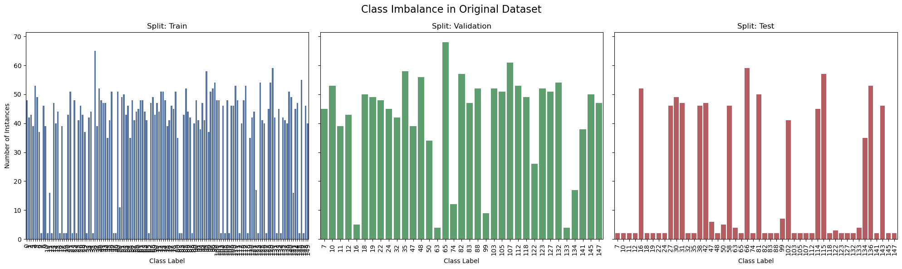
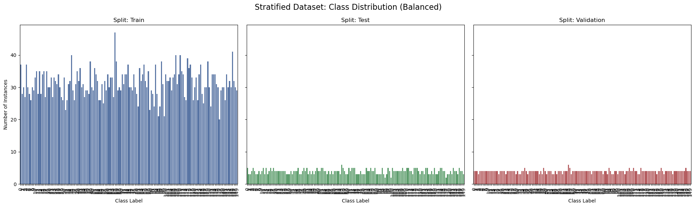
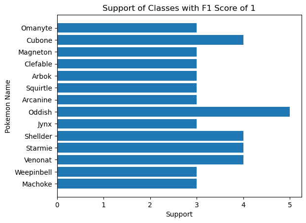

# Pokémon Image Classifier: Dynamic CNN with Hyperparameter Optimization

A high-performance deep learning pipeline designed to classify 150 Pokémon species. This project implements a custom **DynamicCNN** architecture that can adapt its layer configuration during training, enabling automated architectural search combined with a **Hyperparameter Optimization** (HPO) workflow.

### The Problem

Classifying 150 Pokémon species from a dataset with high class imbalance. Over 50% of classes in the training set have very few or no examples in test/validation splits, meaning we would be unable to accurately assess the model's performance.


Even after performing a stratified split, the support of each class in the test and validation splits is quite low. Using `torchvision.transforms`for data augmentation is vital to prevent overfitting and increase effective training samples.


Macro F1 can be misleading for classes with very few examples(some classes had F1 scores of 1 with ≤5 samples) Therefore, **Accuracy** is used as the primary metric.



### The Results

| Metric         | Value  |
| -------------- | ------ |
| Top-1 Accuracy | 67.86% |
| Top-5 Accuracy | 89.40% |
| Macro F1       | 68.85% |

_Note: Due to high class imbalance and very low support in some classes, the Macro F1 score is likely artificially inflated._

###

---

### Live Demo

<a href="https://poke-classifier-pytorch.streamlit.app/" target="_blank" rel="noopener noreferrer">Check out the interactive web app here!</a>

_Upload your own Pokémon image or choose from a curated sample gallery to see the model's Top-5 predictions in real-time._

### Model Architecture

The model is a **Dynamic Convolutional Neural Network** consisting of four sequential feature extraction blocks followed by a fully connected classification head.

<details>
<summary>Click to view detailed layer-by-layer summary</summary>

<br>

```text
==========================================================================================
Layer (type:depth-idx)                   Output Shape              Param #
==========================================================================================
DynamicCNN                               [1, 150]                  --
├─Sequential: 1-1                        [1, 256, 14, 14]          --
│    └─Sequential: 2-1                   [1, 32, 112, 112]         --
│    │    └─Conv2d: 3-1                  [1, 32, 224, 224]         896
│    │    └─BatchNorm2d: 3-2             [1, 32, 224, 224]         64
│    │    └─ReLU: 3-3                    [1, 32, 224, 224]         --
│    │    └─MaxPool2d: 3-4               [1, 32, 112, 112]         --
│    └─Sequential: 2-2                   [1, 64, 56, 56]           --
│    │    └─Conv2d: 3-5                  [1, 64, 112, 112]         18,496
│    │    └─BatchNorm2d: 3-6             [1, 64, 112, 112]         128
│    │    └─ReLU: 3-7                    [1, 64, 112, 112]         --
│    │    └─MaxPool2d: 3-8               [1, 64, 56, 56]           --
│    └─Sequential: 2-3                   [1, 128, 28, 28]          --
│    │    └─Conv2d: 3-9                  [1, 128, 56, 56]          73,856
│    │    └─BatchNorm2d: 3-10            [1, 128, 56, 56]          256
│    │    └─ReLU: 3-11                   [1, 128, 56, 56]          --
│    │    └─MaxPool2d: 3-12              [1, 128, 28, 28]          --
│    └─Sequential: 2-4                   [1, 256, 14, 14]          --
│    │    └─Conv2d: 3-13                 [1, 256, 28, 28]          295,168
│    │    └─BatchNorm2d: 3-14            [1, 256, 28, 28]          512
│    │    └─ReLU: 3-15                   [1, 256, 28, 28]          --
│    │    └─MaxPool2d: 3-16              [1, 256, 14, 14]          --
...
Forward/backward pass size (MB): 48.18
Params size (MB): 207.70
Estimated Total Size (MB): 256.48
==========================================================================================
```

</details>

## Features

### 1. Dynamic Architecture

The `DynamicCNN` is a flexible PyTorch implementation that adapts to configuration-driven depth and width:

- **Customizable Convolutional Blocks**: Supports `n_layers` convolutional blocks with configurable `n_filters` and `kernel_sizes` per block. Each block includes Conv2d → BatchNorm → ReLU → MaxPool.

- **Automatic Classifier Sizing**: Dynamically calculates the flattened feature map size after the convolutional layers, so the fully connected classifier automatically adapts to any configuration or input image size.

- **Built-in Regularization:** Includes Dropout in the fully connected layers and Batch Normalization in the convolutional blocks to reduce overfitting on small or imbalanced datasets.

- **Flexible Fully Connected Head**: `fc_size` is configurable, allowing easy scaling of the classifier complexity to match dataset size or computational budget.

### 2. Automated HPO Workflow

Leveraging **Optuna** and **Hydra**, the training pipeline explores a multi-dimensional search space:

- **Regularization:** Adaptive Dropout rates and Label Smoothing (up to $0.2$) are explored automatically.
- **Early Stopping:** `MedianPruner` terminates underperforming trials early to save compute resources.
- **Saved Optimal Hyperparameters:** After 50 Optuna trials, the best hyperparameters are saved in `config/config.yaml` for direct use or further fine-tuning.

### 3. Professional Experiment Tracking

- **Weights & Biases (W&B):** Real-time logging of training/validation loss, Top-1/Top-5 accuracy, and gradient distributions for reproducible experiments.
- **Hydra:** Version-controlled configuration management for reproducible experiments.

---

## Project Structure

```text

├── app.py              # Interactive Streamlit Web Application
├── train.py            # Main training script for single-run execution
├── hpo.py              # Optuna optimization entry point (Bayesian Search)
├── eval.py             # Script for final test-set evaluation & metrics
├── predict.py          # CLI tool for single-image inference
├── config/             # Hydra YAML configurations
│   ├── config.yaml     # Default training settings
├── data/               # Pokémon dataset (Cleaned & Preprocessed)
├── models/             # Saved checkpoints (.pth files + training metadata)
├── notebooks/          # Jupyter notebooks for EDA
|    |── EDA.ipynb
├── samples/            # Curated images for Streamlit demo testing
|── tests/              # Tests for function in src/
├── src/                # Modular source code package
│   ├── __init__.py     # Makes src a Python package
│   ├── dataset.py      # Custom PyTorch Dataset class
│   ├── data_setup.py   # DataLoaders and preprocessing pipelines
│   ├── model.py        # DynamicCNN architecture definition
│   ├── engine.py       # Core Train/Val/Top-K Evaluation loops
│   └── utils.py        # Logging, W&B setup, and stat calculations
└── requirements.txt    # Project dependencies
```

## Getting Started

### 1. Installation

`pip install -r requirements.txt`

### 2. Download Data

Project requires that `data/pokemon_clean` is downloaded.

`python data_setup.py`

### 3. Run Hyperparameter Optimization

Launches a new hyperparameter optimization study with 20 Bayesian search trials by default (configurable in `config/config.yaml`).

`python hpo.py`

### 4. Train Model with Optimal Hyperparameters

You can either:

**Option A**: Update the config file

- Modify `config/config.yaml` with your desired hyperparameters.
- Then run `python train.py`

**Option B**: Override via CLI (Hydra)

- Parameters in the CLI take priority over those in `config/config.yaml`
- For example, to change the `batch_size` and `lr` hyperparameters, run: `python train.py training.batch_size=32 training.lr=0.001 model.n_layers=2`

### 5. Run Final Evaluation

Load the best weights from the `models/`directory and evaluate on the hold-out test set:

`python eval.py`

### 6. Single Image Inference

`python predict.py`

### Data Limitations & Notes

- The number of training images in the [fcakyon/pokemon-classification](https://huggingface.co/datasets/fcakyon/pokemon-classification) dataset was reduced to fewer than 5,000 after using a pretrained CNN to remove augmented or duplicate images.
- Pokémon cards all look quite similar, and as a result the model struggles when the sample is a picture of a Pokémon card
- Model will always give a prediction, even on Pokémon it was not trained on
- Dataset does not include Nidoran, both male and female versions
- Dataset includes Alolan Sandslash from Generation VI

---

### In Progress

- Hyperparameter analysis
- Fine-tune a pretrained ResNet-18 model on the same dataset and compare the performance of the two models
